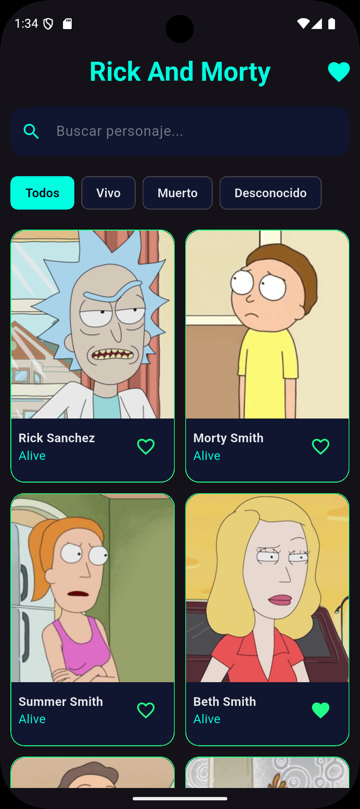
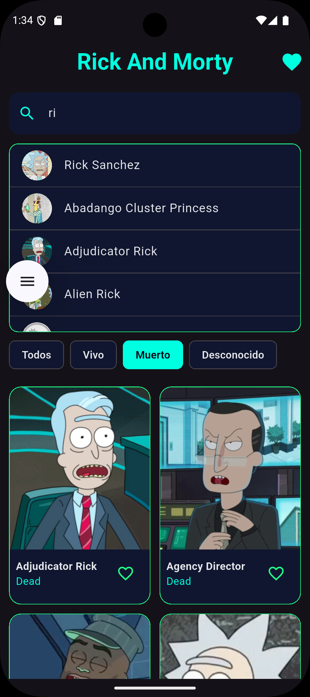
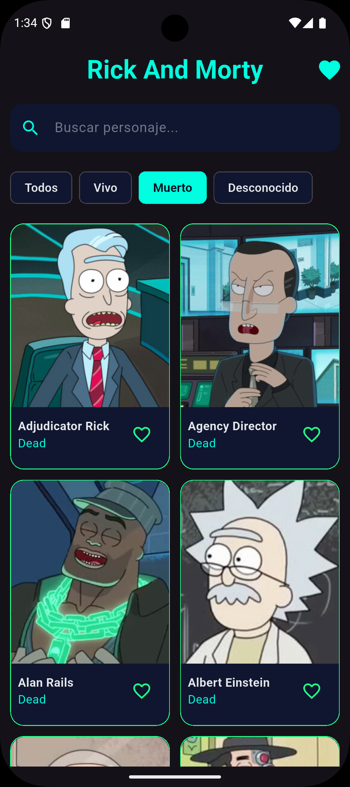
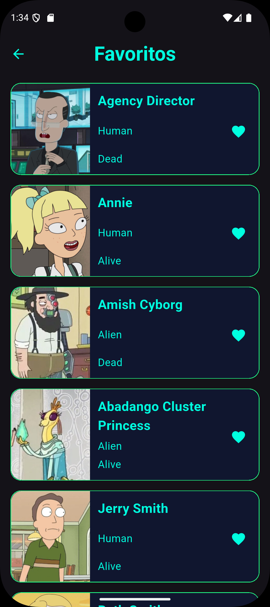

# Prueba Tecnica 1 - Rick and Morty

Aplicacion Flutter que consume la API publica de Rick and Morty para listar personajes, buscar y filtrar por estado, ver detalle y administrar favoritos con persistencia local. El objetivo del proyecto es demostrar una arquitectura limpia por features, manejo de estado con Riverpod y una UI enfocada en rendimiento y buena experiencia de usuario.

**Capturas**






**Funcionalidades**

- Listado de personajes con paginacion e infinite scroll.
- Busqueda por nombre con sugerencias en tiempo real.
- Filtro por estado: Todos, Vivo, Muerto, Desconocido.
- Detalle de personaje con informacion general, origen y episodios.
- Favoritos persistentes en almacenamiento local.
- Tema oscuro con paleta sci-fi.

**Experiencia de usuario**

- Busqueda sincrona con resultados inmediatos mientras el usuario escribe.
- Navegacion rapida a detalle desde la busqueda y desde el listado.
- Feedback visual ante estados de carga y errores.
- Imagenes cacheadas para mejorar tiempos de carga.

**Stack y dependencias clave**

- Flutter (Dart SDK ^3.9.2)
- State management: `hooks_riverpod`
- Navegacion: `go_router`
- HTTP: `http`
- Cache de imagenes: `cached_network_image`
- Modelado: `freezed` + `json_serializable`
- Persistencia local: `shared_preferences`

**API**

- Base URL: `https://rickandmortyapi.com/api`
- `GET /character` para listado con paginacion y filtros (`status`, `name`)
- `GET /character/{id}` para detalle

**Arquitectura**

La app sigue una organizacion por features con separacion en capas. Cada feature contiene sus propias capas y responsabilidades para mantener un codigo escalable y facil de mantener:

- `data` manejo de fuentes de datos, modelos y repositorios concretos.
- `domain` entidades, repositorios abstractos y casos de uso.
- `presentation` UI, providers y widgets.
- `core` utilidades compartidas (http, rutas, errores, tokens, servicios).

**Flujo de datos (resumen)**

- La UI solicita datos a un provider de Riverpod.
- El provider ejecuta un caso de uso del dominio.
- El caso de uso usa un repositorio abstracto.
- El repositorio concreto obtiene datos desde un datasource remoto.
- El resultado regresa a la UI, que renderiza estados de carga, exito o error.

**Manejo de errores**

- Errores de red y timeout se traducen a excepciones controladas.
- Errores de servidor y parseo generan mensajes legibles para el usuario.
- Se reutiliza un conjunto de mensajes centralizados en `core/utils/constants.dart`.

**Persistencia de favoritos**

- Los favoritos se almacenan en `SharedPreferences` como JSON.
- Se mantiene una lista local sincronizada con la UI para refrescar el estado.

**Estructura de carpetas (resumen)**

- `lib/main.dart` punto de entrada y configuracion de providers.
- `lib/main_app.dart` configuracion de tema y rutas.
- `lib/core/routes/routes.dart` definicion de navegacion.
- `lib/feature/home` listado, busqueda y filtros.
- `lib/feature/character` detalle de personaje.
- `lib/feature/favorite` favoritos persistentes.
- `assets/images` capturas usadas en esta documentacion.

**Rutas**

- `/` Home
- `/favorite` Favoritos
- `/character` Detalle (requiere `extra` con el id)

**Requisitos**

- Flutter SDK instalado (compatible con Dart ^3.9.2).
- Emulador o dispositivo fisico configurado.

**Instalacion y ejecucion**

```bash
flutter pub get
flutter run
```

**Tests**

```bash
flutter test
```

**Codegen (si se requiere regenerar modelos)**

```bash
dart run build_runner build --delete-conflicting-outputs
```

**Notas**

- La navegacion se realiza con `GoRouter`.
- Las imagenes de personajes se cachean para mejorar rendimiento.
- El proyecto esta listo para extenderse con mas filtros o nuevas secciones.
