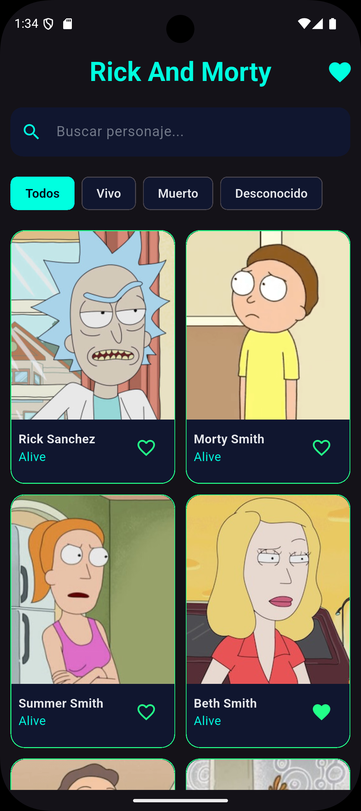
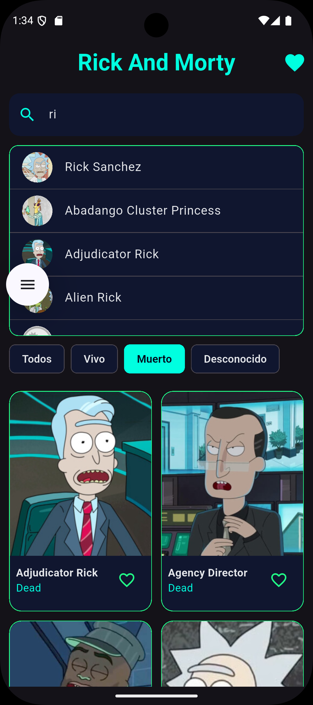
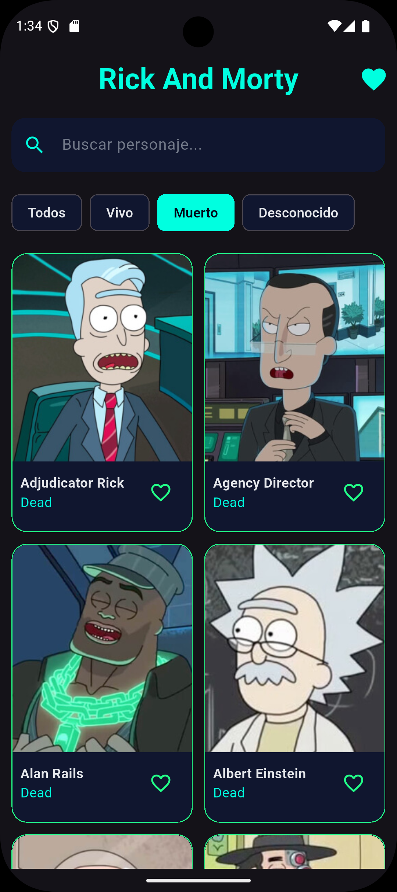
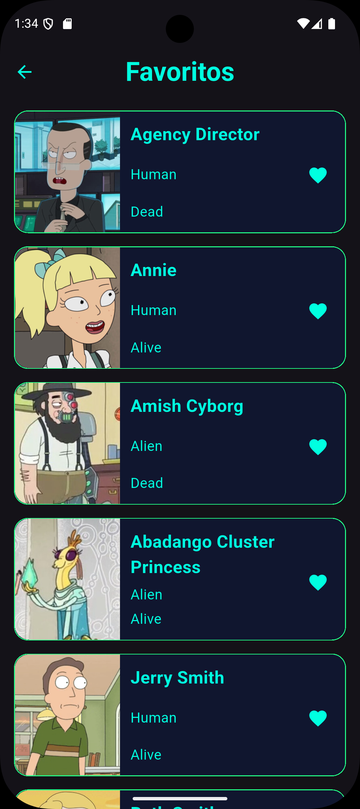
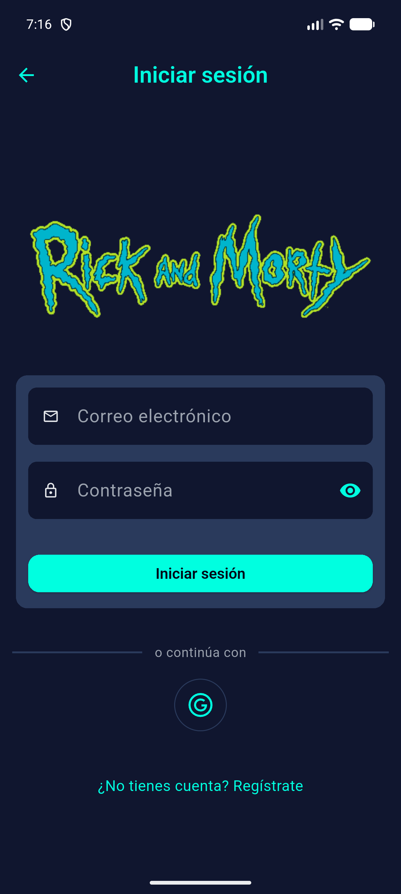
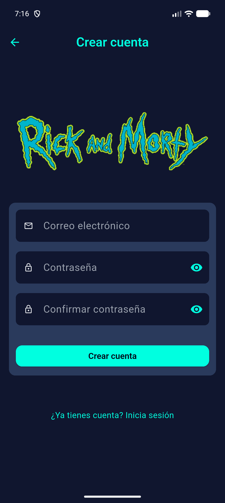
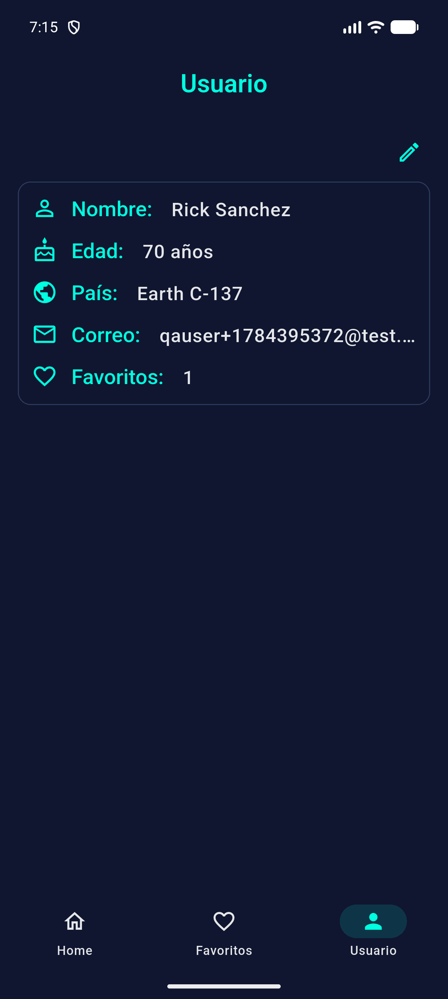

# Prueba Tecnica 1 - Rick and Morty

Aplicacion Flutter que consume la API publica de Rick and Morty para listar personajes, buscar y filtrar por estado, ver detalle y administrar favoritos. Incluye autenticacion real con Firebase (correo/contrasena y Google), favoritos y perfil de usuario persistidos por cuenta en Cloud Firestore, y una UI construida sobre un design system propio (`atomic_design`) con tema oscuro sci-fi. El objetivo del proyecto es demostrar una arquitectura limpia por features, manejo de estado con Riverpod y una UI enfocada en rendimiento y buena experiencia de usuario.

**Capturas**









**Funcionalidades**

- Listado de personajes con paginacion e infinite scroll.
- Busqueda por nombre con debounce y ranking de resultados en tiempo real.
- Filtro por estado: Todos, Vivo, Muerto, Desconocido.
- Detalle de personaje con informacion general, origen y episodios.
- Inicio de sesion y registro con correo/contrasena, e inicio de sesion con Google.
- Favoritos persistentes por usuario en Cloud Firestore (requieren sesion iniciada).
- Perfil de usuario editable (nombre, edad, pais) con correo y cantidad de favoritos.
- Tema oscuro con paleta sci-fi, construido sobre el design system `atomic_design`.

**Experiencia de usuario**

- Busqueda con resultados casi inmediatos mientras el usuario escribe (debounce de 350ms).
- Navegacion rapida a detalle desde la busqueda y desde el listado.
- Feedback visual ante estados de carga y errores.
- Imagenes cacheadas para mejorar tiempos de carga.
- Acciones que requieren sesion (favoritos) muestran un aviso con acceso directo a login en vez de fallar silenciosamente.

**Stack y dependencias clave**

- Flutter `3.44.6` (Dart SDK `^3.11.1`)
- State management: `hooks_riverpod`
- Navegacion: `go_router`
- HTTP: `http`
- Cache de imagenes: `cached_network_image`
- Modelado: `freezed` + `json_serializable`
- Manejo funcional de errores: `dartz` (`Either<Failure, T>`)
- Autenticacion: `firebase_core`, `firebase_auth`, `google_sign_in`
- Persistencia remota: `cloud_firestore`
- Design system: `atomic_design` (paquete propio, dependencia git)

**API**

- Base URL: `https://rickandmortyapi.com/api`
- `GET /character` para listado con paginacion y filtros (`status`, `name`)
- `GET /character/{id}` para detalle

**Arquitectura**

La app sigue Clean Architecture organizada por features (no por capas globales). Cada feature (`home`, `character`, `favorite`, `auth`, `user`) contiene sus propias capas y responsabilidades:

- `data` datasources remotos, modelos (`json_serializable`), adapters `Model -> Entity` y repositorios concretos que devuelven `Either<Failure, T>`.
- `domain` entidades (`freezed`), repositorios abstractos y casos de uso (wrappers delgados sobre el repositorio).
- `presentation` providers de Riverpod (`Notifier` + estados `@freezed`), paginas y widgets.
- `core` utilidades compartidas: cliente HTTP, manejo de errores, rutas, constantes.

Toda la UI se construye con `atomic_design` (`AppText`, `AppButtons`, `AppInputText`, `AppCard`, `AppNetworkImage`, `AppBottomSheet`, `AppSnackBar`, etc.); no hay estilos ni colores hardcodeados fuera de los tokens del design system (`assets/config/app_config.json`).

**Flujo de datos (resumen)**

- La UI observa un provider de Riverpod.
- El provider (`Notifier`) ejecuta un caso de uso del dominio.
- El caso de uso llama al repositorio abstracto.
- El repositorio concreto obtiene datos desde un datasource (REST o Firestore) y traduce excepciones a `Failure`.
- El resultado (`Either<Failure, T>`) regresa al provider, que actualiza su estado `@freezed` (`initial/loading/loaded/error`), y la UI renderiza en consecuencia.

**Manejo de errores**

- Dos niveles: `core/error/exceptions.dart` (excepciones tipadas desde datasources) y `core/error/failure.dart` + `error_mapper.dart` (traduccion a `Failure` con mensajes en espanol).
- Errores de red y timeout se traducen a `NetworkException`/`NetworkFailure`.
- Errores de servidor, parseo y autenticacion tienen su propio tipo (`ServerException`, `ParsingException`, `AuthException`, etc.).
- Los mensajes legibles para el usuario viven centralizados en `core/utils/constants.dart` (`ErrorMessages`, `AuthErrorMessages`).

**Autenticacion**

- Backed por `FirebaseAuth` real (correo/contrasena con `signInWithEmailAndPassword`/`createUserWithEmailAndPassword`, y Google via `google_sign_in` v7).
- El estado de sesion se expone como `isLoggedInProvider`, sincronizado con `authStateChanges()`.
- Las pantallas de Login y Registro estan en `feature/auth/presentation/page`, construidas con atomos de `atomic_design`.
- Toggle de favoritos y acceso a la pantalla de Usuario estan protegidos por `requireAuth` (`feature/auth/presentation/helpers/require_auth.dart`), que muestra un `AppSnackBar` con acceso a login si no hay sesion.

**Persistencia**

- Los favoritos se guardan en Cloud Firestore, uno por usuario: `users/{uid}/favorites/{characterId}`.
- El perfil de usuario (nombre, edad, pais) se guarda en el documento `users/{uid}`.
- Ambos estan protegidos por `firestore.rules` (solo el dueno de la cuenta puede leer/escribir su propio `users/{uid}/**`). Este archivo debe pegarse manualmente en Firebase Console -> Firestore Database -> Rules; no hay CLI de Firebase automatizada en este repo.
- No hay sincronizacion en tiempo real (sin listeners): favoritos y perfil se recargan al iniciar sesion.

**Estructura de carpetas (resumen)**

- `lib/main.dart` punto de entrada, inicializacion de Firebase y del design system.
- `lib/main_app.dart` configuracion de tema (`AppThemeProvider`) y rutas.
- `lib/core/routes/routes.dart` definicion de navegacion con `go_router`.
- `lib/core/routes/main_shell_page.dart` shell con la barra de navegacion inferior.
- `lib/feature/home` listado, busqueda y filtros.
- `lib/feature/character` detalle de personaje.
- `lib/feature/favorite` favoritos persistentes por usuario (Firestore).
- `lib/feature/auth` login, registro y sesion (Firebase Auth).
- `lib/feature/user` perfil de usuario editable.
- `assets/images` capturas usadas en esta documentacion.
- `assets/config/app_config.json` tokens del design system (colores, tipografia, spacing).

**Rutas**

- `/` Home (dentro del shell con barra de navegacion)
- `/favorite` Favoritos (dentro del shell)
- `/user` Usuario (dentro del shell, solo visible con sesion iniciada)
- `/character` Detalle, ruta de nivel superior (requiere `extra` con el id como `int`)
- `/login` y `/register` rutas de nivel superior, pantalla completa sin barra de navegacion

**Requisitos**

- Flutter `3.44.6` (Dart SDK `^3.11.1`).
- Emulador o dispositivo fisico configurado.
- Proyecto de Firebase configurado (`flutterfire configure`) si se va a compilar contra un backend propio.

**Instalacion y ejecucion**

```bash
flutter pub get
flutter run
```

**Tests**

```bash
flutter analyze   # debe quedar limpio, CI bloquea sobre esto
flutter test
```

**Codegen (si se requiere regenerar modelos)**

```bash
dart run build_runner build --delete-conflicting-outputs
```

**Integracion continua**

- `.github/workflows/ci.yml` corre `flutter analyze` y `flutter test` en cada PR/push a `main`/`develop`/`release`, y si pasan compila el AAB de Android y el build de iOS (sin firmar).

**Notas**

- La navegacion se realiza con `GoRouter` (`StatefulShellRoute.indexedStack` para las tres pestanas del bottom nav).
- Las imagenes de personajes se cachean para mejorar rendimiento.
- En Windows, un build de Android puede mostrar un stack trace de Kotlin no fatal (`Could not close incremental caches ... different roots`) si el pub cache y el proyecto estan en unidades distintas; el APK igual se genera e instala.
- El proyecto esta listo para extenderse con mas filtros o nuevas secciones.
